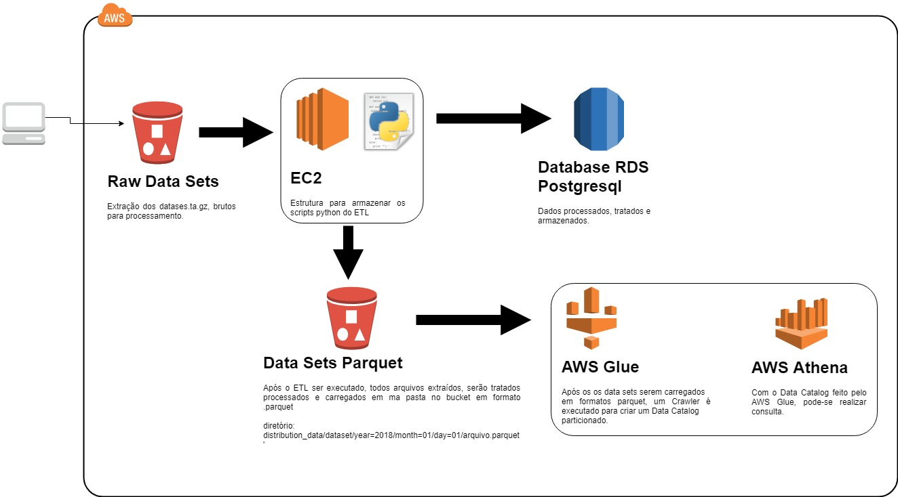

# Creditas Data Engineering Challenge

### Desenvolvimento do ETL para o teste imposto.
Para este teste assumi o seguinte senário para o processamento do mesmo:
-	Os arquivos datasets.tar.gz são colocados em um bucket do AWS S3 por algum processo externo ou interno que é alimentado todo dia com dados atualizados em uma pasta que chamo de “files_raw” (não particionei a mesma).

### Arquitetura ETL.

### Preparação do Ambiente.

### Todas as configurações descritas abaixo são necessárias para pleno funcionamento do ETL. 
1.	Criar um bucket no AWS S3.
2.	Criar o diretório no bucket criado.
2.1.	<nome_bucket>/files_raw.
3.	Criar um “access key e secret access key “, com policie de read e write ao bucket criado.
4.	Criar um AWS RDS (Relational Database Service) – Postgresql.
4.1.	Acessar o banco de dados criado e executar o script “create_tables.sql” em anexo
5.	Descompactar arquivo “dev.zip” em anexo.
5.1.	Alteraçoes em arquivos do ETL:
5.1.1.	“connect.py”: alterar as 7 ao 10, com as configurações do AWS RDS criada.
5.1.2.	“variables.py”: alterar as linhas 4 ao 6, as com o nome do bucket criado e as chaves de acesso criadas.
6.	Compactar novamente em zip todos os arquivos do etl com o nome de “etl_creditas.zip”

#### Obs:

Ao processar os arquivos imposto no teste, houve um erro que em um valor, o mesmo se referia à um valor de formato "date" que não poderia ser
processado. 

Minha ação quando este cenário ocorre, seria informar à pessoa que disponibiliza os dados para o processamento do meu ETL para que o mesmo,
verificasse este tipo de erro. Assumindo que não poderia "construir dados", sem saber a que se referia.

Com isso coloco em anexo um datasets.tar.gz, simulando que o mesmo resolveu este impasse. Para dar continuidade ao teste, o mesmo deve ser colocado no Bucket criado e no diretório "files_raw" antes de executar o ETL
O valor com erro ao qual me refiro é encontrado no arquivo dca_dataset_utilization_and_claims.jsonl

"Guarantee End Date": "2027/09" (está faltando o "dia")

### Execução do ETL.

O ETL é executado em uma instância AWS EC2 Linux (pode ser a t2.micro).
Todos os scripts são em Python 2.7 e alguns .sql.

### Deploy.

1.	Criar um diretório /home/ec2-user/etl/etl_creditas/
2.	Copiar o arquivo zip etl_creditas.zip em anexo para o servidor EC2, no diretório /home/ec2-user/etl/etl_creditas/.
3.	Extrair o arquivo.
4.	Executar script abaixo para dar permissão de execução ao shell script.
4.1.	chmod +x /home/ec2-user/etl/etl_creditas/cr_etl_controller.sh
5.	Para execução diária agendar no crontab do linux.
5.1.	0 7 * * * /home/ec2-user/etl/etl_creditas/cr_etl_controller.sh
Para execução manual do ETL, executar o comando no terminal Linux
sh /home/ec2-user/etl/etl_creditas/cr_etl_controller.sh

