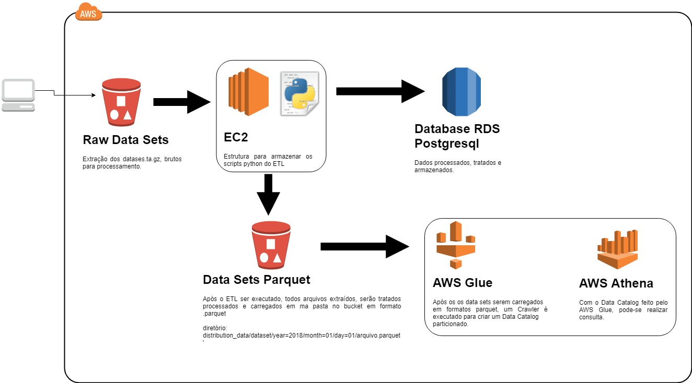

# Data Engineering Challenge

### Objetivo
Este pequeno projeto tem o objetivo de executar um fluxo de ETL para processamento de dados utilizando o ambiente AWS e Python 3.

### Recursos Tecnológicos
1. Python 3.X
	- Bibliotecas necessárias para instalar
		- Pandas
		- Boto3
		- Pyarrow
		- Psycopg2
		- Virtualenv
2. AWS
	- Serviços utilizados:
		- RDS (PostgreSql)
		- EC2 (Linux)
		- S3

### Cenário
Fonte original dos dados: data.usaid.gov
Para este processo assumi-se o seguinte cenário.
	Proprietários dos dados de origem disponibilizam os arquivos diariamente para processamento em um bucket do S3.
		Dado que:
		- source_bucket = nome do bucket definido pelo dono da conta.
		- raw_file = pasta criada no bucket.
		- datasets.tar.gz = arquivos origens para processamento, inseridos pelo proprietário.
			<source_bucket>/raw_file/datasets.tar.gz

Sobre os arquivos:

#### dca_dataset_loan_transactions.jsonl
This dataset is the complete list of all private loans made under USAID's DCA since it was established in 1999. To protect the personal information of borrowers and bank partners, all strategic and personal identifiable information was removed. For explanations and limitations of the dataset, download the attachment in the metadata.

#### url: *[https://www.usaid.gov/developer/dca-loan-transactions](https://www.usaid.gov/developer/dca-loan-transactions)*
 
#### dca_dataset_utilization_and_claims.jsonl
This dataset is the complete list of all USAID partial credit guarantees since DCA was established in 1999. This USAID dataset shows the partial credit guarantees that USAID has issued since the development credit authority program was founded in 1999. The spreadsheet reflects the full facility size of each guarantee, how much was lent under the guarantee, the status of the guarantee (i.e., active or expired) , how much in claims the bank submitted due to losses it incurred for loans placed under the guarantee, and how many loans were placed under coverage of the guarantee. The data also shows the sector and country for each guarantee.

#### url: *[https://www.usaid.gov/developer/dca-utilizations-and-claims](https://www.usaid.gov/developer/dca-utilizations-and-claims)*
 
#### hdi_human_development_index_hdig_value.jsonl
HDI from 1980 to 2013.

#### url: *[https://data.humdata.org/dataset/human-development-index-hdi](https://data.humdata.org/dataset/human-development-index-hdi)*

#### world_currencies_conversion_rates.csv
Dollar based conversion rates for world currencies from 1950 to 2017.

#### url: *[https://data.oecd.org/conversion/exchange-rates.htm](https://data.oecd.org/conversion/exchange-rates.htm)*
	

### Arquitetura ETL.

### Preparação do Ambiente de Simulação.

### Todas as configurações descritas abaixo são necessárias para pleno funcionamento do ETL.
Ambiente Amazon Web Services (AWS)
1. Simple Storage Service (S3)
	- Criar/utilizar um bucket.
2. Criar o diretório no bucket.
	- <nome_bucket>/raw_files.
3. Criar um “access key e secret access key “, com policie de read e write para o bucket que será utilizado.
4. Relational Database Service (RDS).
	- Criar/utilizar Banco de dados RDS PostgreSql.
